# Postloom user guide

Postloom sends a personal email to each person on a list, from your own email
account. You write the email once, leaving gaps for details like a first name
or an invoice number. Postloom fills them in for each person from your
spreadsheet, checks everything with you, and then sends.

Everything stays on your computer. Your lists, templates and History are kept
on this computer only. Your email password is kept in your computer's own
password store, never in Postloom's files.

**Contents**

1. [Install Postloom](#1-install-postloom)
2. [Connect your email](#2-connect-your-email)
3. [Senders and brand looks](#3-senders-and-brand-looks)
4. [Make a template](#4-make-a-template)
5. [Set out your list](#5-set-out-your-list)
6. [Send emails](#6-send-emails)
7. [History and reports](#7-history-and-reports)
8. [Settings, backups and new versions](#8-settings-backups-and-new-versions)
9. [Keeping your data safe](#9-keeping-your-data-safe)
10. [When something goes wrong](#10-when-something-goes-wrong)

The same help is inside Postloom: choose **Help** at the bottom left, or the
**?** next to any page title.

## 1. Install Postloom

See [Installing Postloom](install.md). It covers which file to download and
what to do when your computer asks before opening it the first time.

When you open Postloom, **Home** shows three steps to get started. Each one
is ticked off as you finish it.

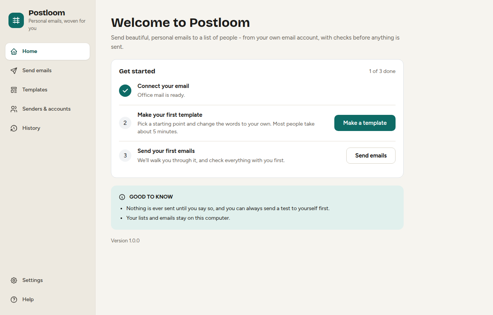

## 2. Connect your email

Postloom sends from your own email address, so replies come straight back to
you. Choose **Connect your email** on Home, then pick your email provider.

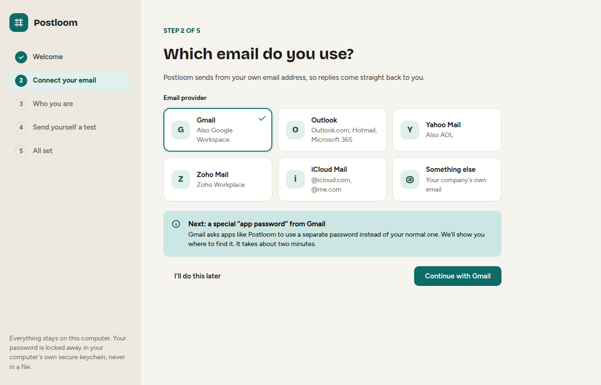

Most providers need an **app password**. This is a separate password just for
Postloom, not your normal one, and you can remove it at any time.

- **Gmail and Google Workspace:**
  1. Go to [myaccount.google.com/apppasswords](https://myaccount.google.com/apppasswords).
     If the page won't let you create one, turn on 2-Step Verification first.
  2. Name the password "Postloom", then copy the 16 letters into Postloom.

  Work or school accounts may have app passwords switched off by the
  administrator. Accounts in Google's Advanced Protection Program can't use
  them at all.
- **Outlook, Hotmail:**
  1. In your Microsoft account, open Security and turn on two-step
     verification.
  2. Create an app password and paste it into Postloom.
- **Microsoft 365 at work:** your IT team may need to turn on "Authenticated
  SMTP" for your mailbox.
- **Yahoo, Zoho, iCloud:** Postloom fills in the server details for you. You
  add your address and an app password.
- **Something else:** you need your outgoing mail server (SMTP) name and port
  from your provider.

Postloom checks that the password works before saving it. On a Mac, the first time
it saves or uses a password your Mac asks to let Postloom use "Postloom Safe
Storage": enter your Mac password and choose **Always Allow**. It asks once
more after each update. It only connects
over an encrypted connection.

Then Postloom asks for the name people see, and offers to send you a test email.
You can manage everything later in **Senders & accounts**.

## 3. Senders and brand looks

**Senders & accounts** has two tabs:

- **Email accounts** do the sending. Each one holds the login and the daily
  limit.
- **Senders** are who your emails appear to come from. A sender has a name,
  an address, and where replies go. One email account can have several
  senders, for example "Asha Kapoor" and "Brightlane Accounts".

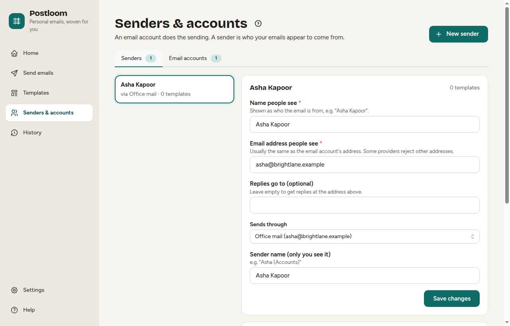

Each sender can have a **brand look**: a logo, a colour and a font. Templates
sent from that sender use it.

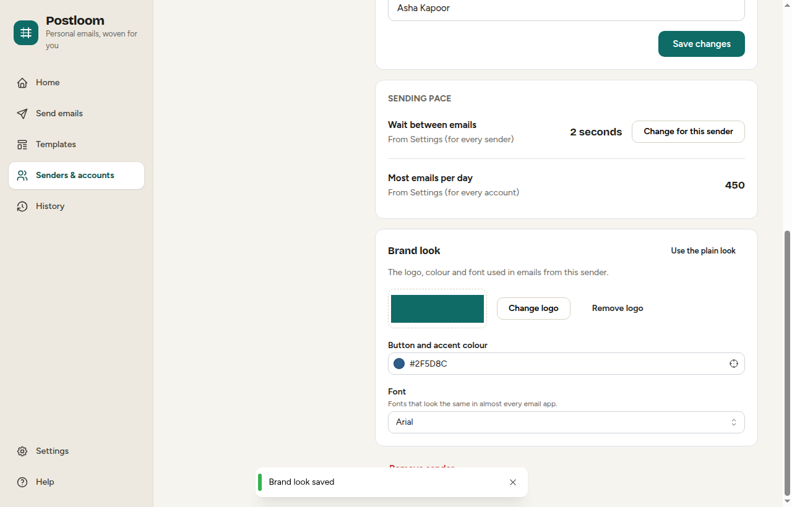

## 4. Make a template

A template is a reusable email with a subject line. In **Templates**, choose
**New template** and pick a starting point. Pick **Plain letter** if you're
not sure.

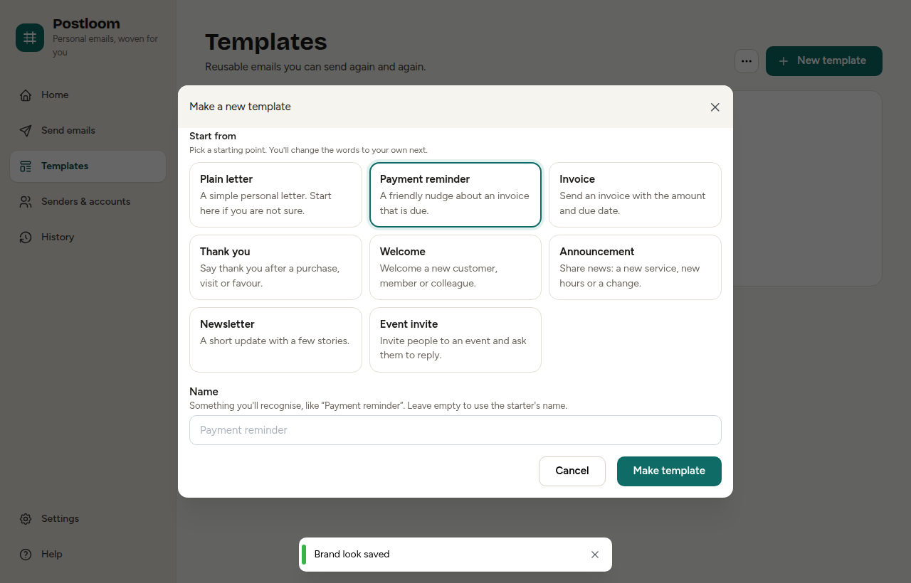

Change the words to your own. Postloom saves as you type.

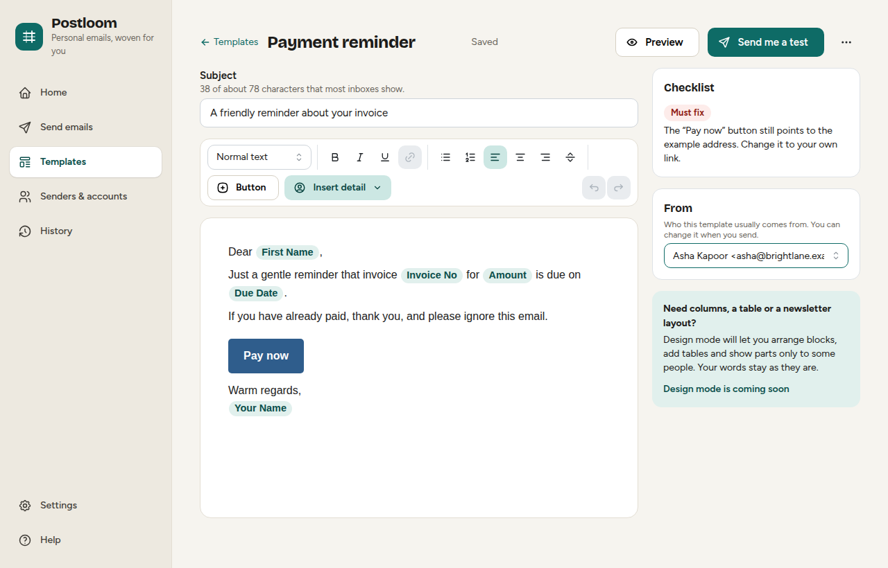

- **Insert detail** adds a gap, like *First Name*. Postloom fills it in from
  the column with the same name in your list. You can give each detail an
  "if empty" text, which is used when someone's cell is blank.
- **Picture** adds a picture. Pictures travel inside each email, so they show
  even when people have internet pictures switched off. Give each one a short
  description for people who can't see pictures.
- **Button** adds a button with a link.
- The **Checklist** on the right lists what still needs attention. For
  example, it warns you when a button still points to the example address.
- **From** is who this template usually comes from. You can change it when
  you send.

**Look** (on the right) sets how this template's emails look:

- **Layout:** **Full width** fills the reader's window, like an email you type
  yourself. It's best for letters, reminders and business email. **Centred**
  puts the email in a column on a coloured background, like a newsletter.
- **Font**, **Text size** and **Button and link colour**.
- **Colour around the email** (Centred only), and whether to **show the
  sender's logo**.

Anything left on "Same as sender" follows the sender's brand look, so one
sender can use different looks in different templates.

**Design** mode is for when you need more than words. It adds columns, tables,
spacers, a footer, and parts shown only to some people. For example, a line
can appear only to people who have a Discount in your list.

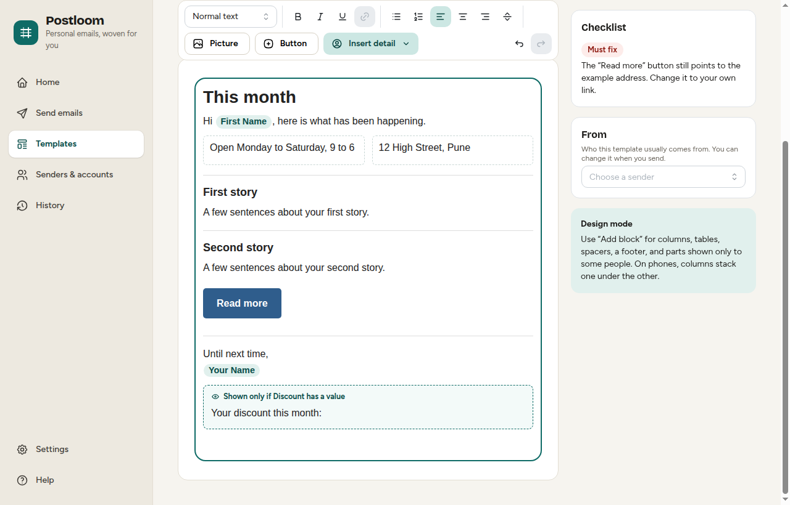

**Preview** shows the email as people will see it, on a computer or a phone.
**Send me a test** sends a copy to you, filled in with example details.
Always send yourself a test before a real send.

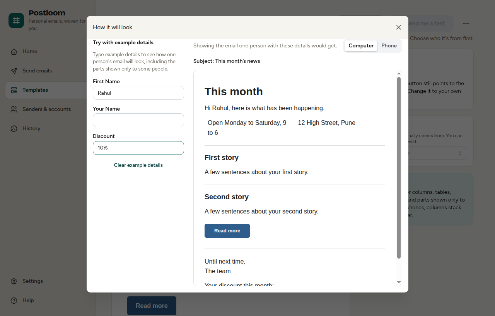

## 5. Set out your list

Your list is an Excel (`.xlsx`) or CSV file:

- one row per person;
- one column per detail;
- the column names in the first row.

Older `.xls` files need saving as `.xlsx` first.

| Email | First Name | Invoice No | Amount | Due Date | Send? |
|---|---|---|---|---|---|
| rahul.mehta@example.com | Rahul | INV-1001 | ₹12,400 | 1 October | yes |
| priya@example.com | Priya | INV-1002 | ₹8,150 | 2 October | yes |

- **Email** (or **To**) holds the addresses. To send to several addresses in
  one cell, separate them with `;` or `,`.
- **Cc** and **Bcc** (optional): addresses to copy in.
- **Send?** (optional): rows that say no, false, 0 or x are left out.
- **Attachment** (optional): files to attach, separated by `;`. Paths can
  start from the list's own folder, like `invoices/INV-1001.pdf`.

## 6. Send emails

**Send emails** walks you through four steps. Nothing is sent until the last
one.

**1. Who to send to.** Choose your spreadsheet. Postloom shows the first rows
and asks which columns hold the addresses.

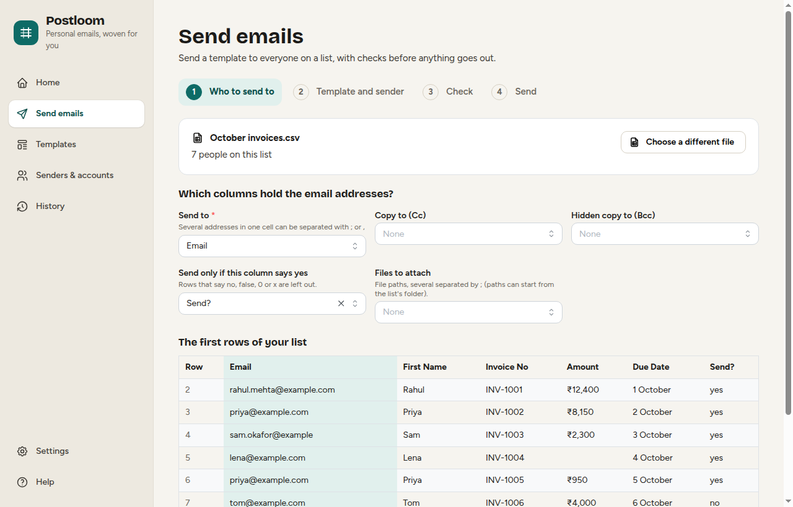

**2. Template and sender.** Choose the template and who it comes from. Then
match each detail in the template to a column in your list.

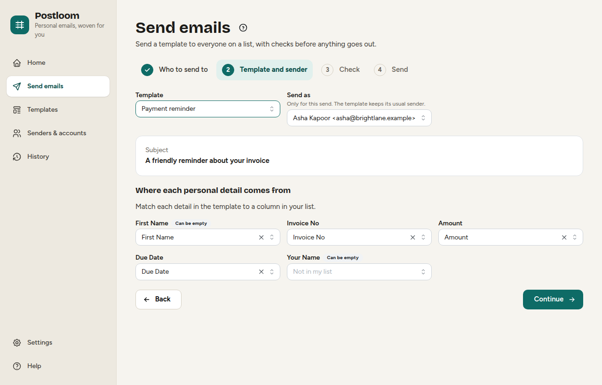

**3. Check.** Postloom checks every row before anything is sent. It looks for:

- addresses that aren't valid;
- empty details;
- repeated addresses;
- people on your "Do not email" list;
- your daily limit;
- attachments.

**Must fix** problems stop the send until you fix them or leave those rows
out. Problems under **Worth a look** are only warnings. On the right, you can
page through each person's own email.

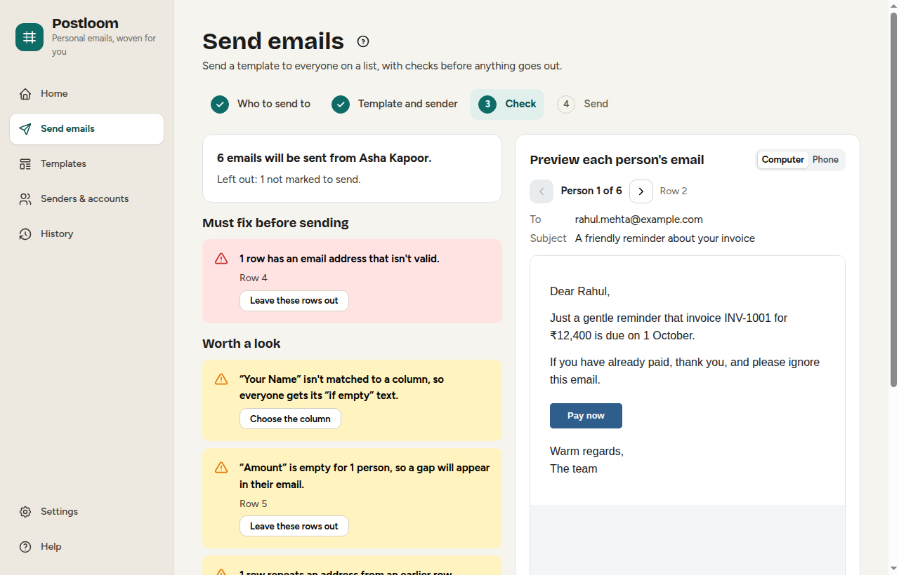

**4. Send.** Postloom says how many emails will go out, from whom, and roughly
how long it will take. Choose **Send now**. By default, Postloom then gives
you 10 seconds to change your mind.

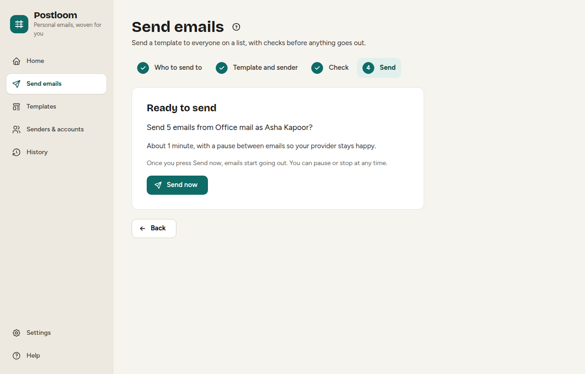

### While it sends

Postloom sends one email at a time, with a short wait between emails, so your
provider doesn't see a burst. You can keep using your computer. **Pause** and
**Stop** take effect once the email going out at that moment has gone.

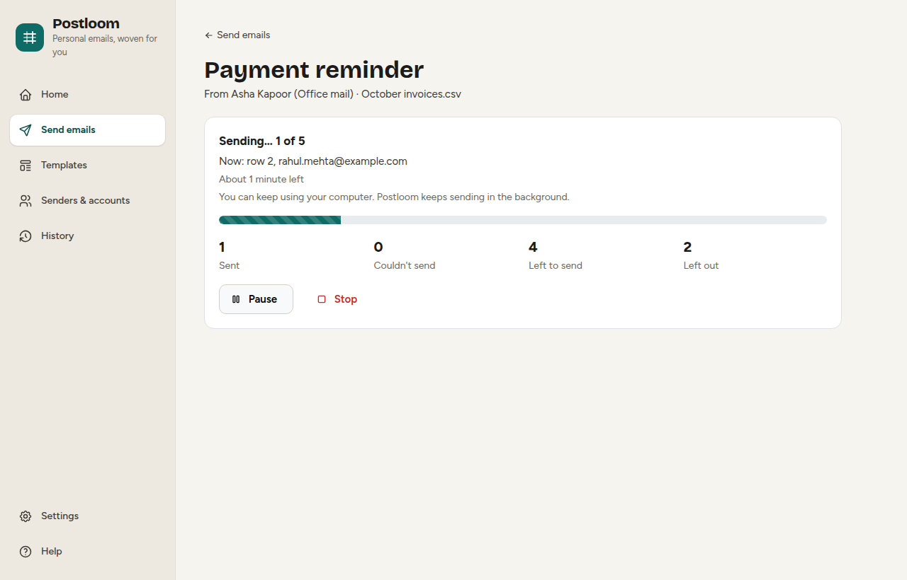

Sending pauses on its own when:

- you reach your daily limit;
- your provider stops accepting the password;
- the internet connection drops;
- the computer goes to sleep.

The page says why it paused, and **Carry on sending** continues where it
stopped.

If the connection drops while an email is going out, Postloom can't tell
whether your provider received it. Rather than risk sending it twice, it asks
you whether to **Send them again** or **Skip them**. Check your Sent folder if
you're unsure. Nobody on the list gets the same email twice, even if the
computer crashes mid-send.

When it's done, you see who got an email and who didn't, and why.
**Try the failed ones again** resends only to the people whose email couldn't
be sent.

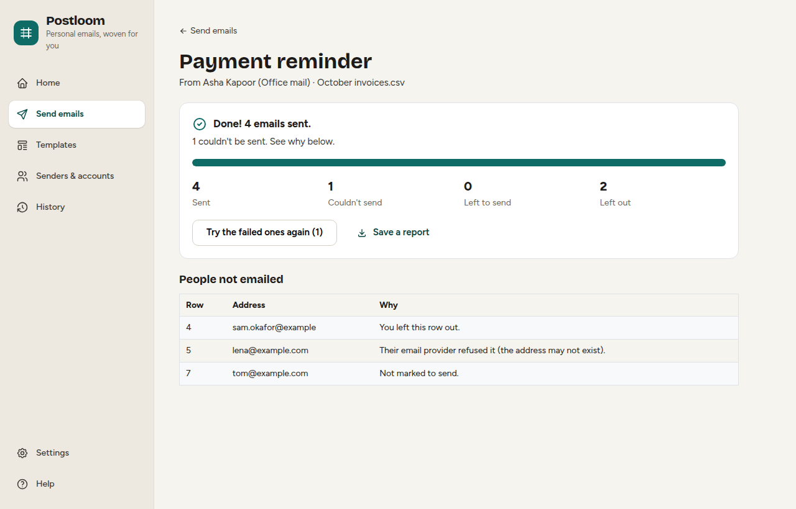

## 7. History and reports

**History** lists every send. Open one to see who got an email, who didn't,
and why. **Save a report** makes a spreadsheet (CSV) of everyone in the send,
for your records.

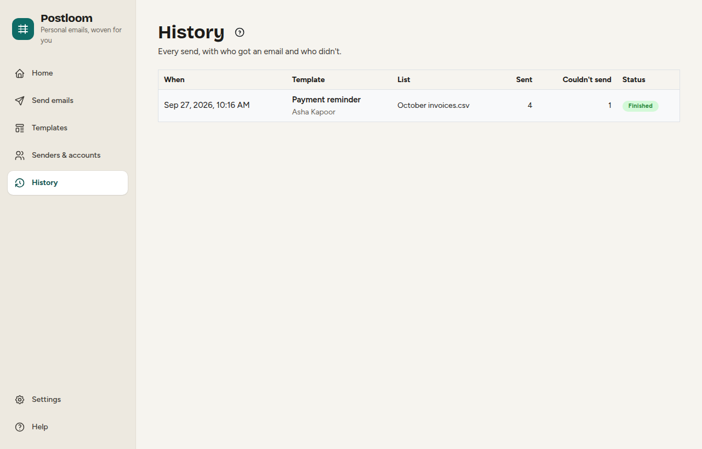

## 8. Settings, backups and new versions

In **Settings** you can:

- choose light or dark colours and a larger text size;
- set the default wait between emails and the daily limit;
- turn off the 10-second chance to change your mind before sending.

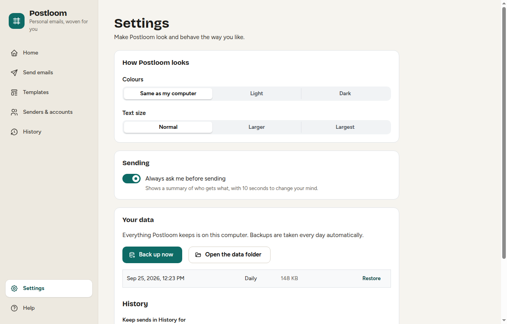

**Your data.** Postloom takes a backup every day it opens. You can also take
one at any time with **Back up now**.

- **Restore** puts everything back as it was on that day. Postloom restarts to
  do it, and keeps today's data aside, just in case.
- Passwords are never kept in backups. After restoring, or on a new
  computer, type them again in Senders & accounts.
- You can choose how long finished sends stay in History, or clear it. Sends
  that aren't finished are always kept.

**New versions.** Postloom looks at its download page once a day. When a new
version is out, a note appears at the bottom left, and **Get it** opens the
download page in your browser. Postloom never downloads or installs anything
by itself. You can turn this off in Settings → About Postloom. The Microsoft
Store version is updated by the Store instead.

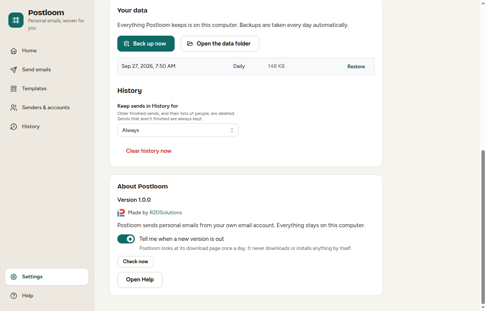

## 9. Keeping your data safe

Postloom's database holds your lists and History. It isn't encrypted, so
anyone who can open your computer while you're signed in could read it. To
protect it:

- Use a password on your computer, and lock the screen when you step away.
- Turn on disk encryption. On a **Mac** that's **FileVault** (System Settings
  → Privacy & Security). On **Windows** it's **Device encryption** or
  **BitLocker** (Settings → Privacy & security). On **Linux**, choose disk
  encryption when installing.
- Keep History only as long as you need it (Settings → Your data).
- Download Postloom only from its
  [Releases page](https://github.com/RavindraDave/postloom/releases) or the
  Microsoft Store.

## 10. When something goes wrong

**"Your email provider didn't accept the password."**
Most providers need an app password (see [Connect your email](#2-connect-your-email)).
If you recently changed your password, update it in Senders & accounts.

**"Postloom couldn't reach your email provider."**
Check your internet connection, then the server name and port in
Senders & accounts. Some workplace networks block outgoing mail. Try from
another network.

**Emails arrive in spam.**
Send yourself a test first. Avoid all-capital subjects and very large
pictures. Sending from your usual address, to people who know you, helps
most.

**Still stuck?**
In **Help**, choose **Export diagnostics** and send the file to support. It
says which version you have and how things are set up. It contains no
passwords, addresses or email content.
